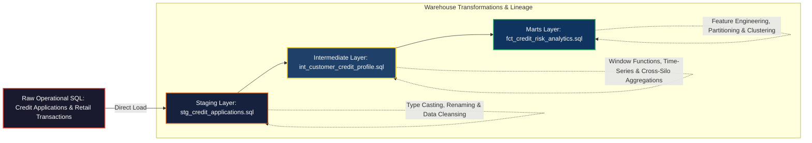

# Analytical Ingestion Pipeline (ELT)

A production-grade dbt (Data Build Tool) repository designed to orchestrate an Extract-Load-Transform pipeline within a BigQuery Data Lakehouse environment.

## Pipeline Architecture and Data Flow

The analytical ingestion pipeline follows a strict ELT (Extract-Load-Transform) paradigm structured via a multi-layered medallion architecture. Raw operational data is transformed into partitioned, query-optimized analytical datasets within the warehouse environment.



## Architecture

The pipeline enforces a structured three-tier medal architecture to ingest and clean transactional legacy data for downstream AI consumption:

1. **Staging Layer (Bronze):** Sanitizes and casts raw relational data into standardized GoogleSQL types.
2. **Intermediate Layer (Silver):** Executes advanced window functions to compute non-leaking historical customer profiles.
3. **Marts Layer (Gold):** Generates optimized, partitioned, and clusterized fact tables optimized for ML model training.

```text
analytic-ingestion-pipeline/
├── dbt_project.yml
└── models/
    ├── staging/      (stg_credit_applications.sql, schema.yml)
    ├── intermediate/ (int_customer_credit_profile.sql)
    └── marts/        (fct_credit_risk_analytics.sql)
```
