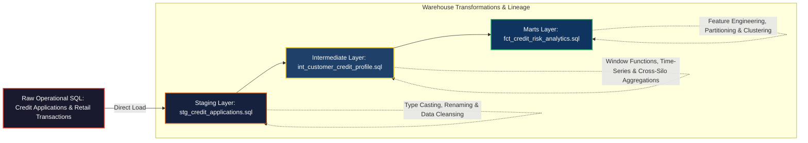

# Analytical Ingestion Pipeline (ELT)

A production-grade dbt (Data Build Tool) repository designed to orchestrate an Extract-Load-Transform pipeline within a BigQuery Data Lakehouse environment.

## Pipeline Architecture and Data Flow

The analytical ingestion pipeline follows a strict ELT (Extract-Load-Transform) paradigm structured via a multi-layered medallion architecture. Raw operational data is transformed into partitioned, query-optimized analytical datasets within the warehouse environment.



## Architecture

The pipeline enforces a structured three-tier medal architecture to ingest and clean transactional legacy data for downstream AI consumption:

1. **Staging Layer (Bronze):** Sanitizes and casts raw relational data into standardized GoogleSQL types.
2. **Intermediate Layer (Silver):** Executes advanced window functions to compute non-leaking historical customer profiles.
3. **Marts Layer (Gold):** Generates optimized, partitioned, and clusterized fact tables optimized for ML model training.

```text
analytic-ingestion-pipeline/
├── dbt_project.yml
└── models/
    ├── staging/      (stg_credit_applications.sql, schema.yml)
    ├── intermediate/ (int_customer_credit_profile.sql)
    └── marts/        (fct_credit_risk_analytics.sql)
```


## Despliegue en Google Cloud Shell (Bypass de Llaves JSON)
Para ejecutar este pipeline de dbt directamente en Google Cloud Shell sin lidiar con restricciones de creación de llaves de cuentas de servicio, configura tu archivo `~/.dbt/profiles.yml` de la siguiente manera:


```yaml
analytics:
  outputs:
    dev:
      type: bigquery
      method: oauth
      project: TU_PROJECT_ID_AQUÍ
      dataset: dbt_staging
      threads: 4
      timeout_seconds: 300
      priority: interactive
  target: dev
```


## Data Architecture & Model Variables (Input)

To simulate the retail CRM data ingestion process into BigQuery (`raw_synapse.tbl_crm_credit_app_raw`), the raw source table must contain the following operational and financial variables for the dbt DAG to compile and run successfully:

| Field Name | Data Type | Description | Model Role & Constraints |
| :--- | :--- | :--- | :--- |
| `id_app` | `STRING` | Unique identifier for the credit application | Primary Key (Enforced via Uniqueness & Not-Null tests) |
| `cod_cli` | `STRING` | Unique customer identification code | Partitioning/Granularity key for analytical window functions |
| `amt_req` | `FLOAT64` | Total credit amount requested by the customer | Quantitative metric (Enforced via custom Positive Value test) |
| `val_income` | `FLOAT64` | Customer's verified or declared monthly income | Financial metric used to evaluate repayment capacity |
| `pct_debt_ratio`| `FLOAT64` | Prior Debt-to-Income (DTI) ratio (0.00 to 1.00) | Core credit risk metric for leverage analysis |
| `cod_store` | `STRING` | Operational code of the brick-and-mortar retail branch | Operational dimension used for regional segmentation |
| `txt_prod_cat` | `STRING` | Commercial category of the product to be financed | Commercial dimension (e.g., Electronics, Motocycles, Appliances) |
| `dt_created` | `STRING` | Timestamp of the application submission | Temporal dimension for trend and cohort analysis |
| `status_op` | `STRING` | Transaction operational status (APPROVED, REJECTED, PENDING) | Transaction status (Enforced via Accepted Values test) |
